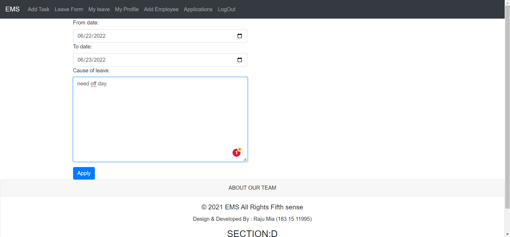

# ***Employee-Management-System-in-python & django***
# -----------------------------EMS
## ⛳Project Name: Employee Management System (EMS).
#💡Introduction: Employee Management System is a distributed application, developed to maintain the details of employees working in any organization. It maintains the information about the personal details of their employees. Our project has some interesting tools like, add daily task,
leave form, leave form list, new employee add system, application maintain
system, login -logout system --and most of them employee personal profile customize option. Also
we will can see your group members and so many features.

# Project Description: 
> Two type of employee:(admin panel view)

# Project View(as a HR roll):
----
> All kind of urls (code view):
    

> Employ login (HR) :
    

> HR profile (user can edit picture and name):
    

> Add Task (HR/employee can post new task.):
    

> Leave Form (HR/employee can apply for leave.):
    

> MY Leave Form (HR/employee can see my-self old all leave Details.):
    

> Add Employee (HR can add New Employee):
    

> Application (HR can all kind of Employee application):
    

> Logout (all user can logout):
    

----- 

# Project View(As an Employee roll):
-----
> Employ login (empoyee) :
    

> Employee profile (user can edit picture and name):
    

> Add Task (HR/employee can post new task.):
    

> Leave Form (HR/employee can apply for leave.):
    

> MY Leave Form (HR/employee can see my-self old all leave Details.):
    

> Logout (all user can logout):
    
-----

## Admin can assign TO DO LIST --(Unfinished work)
---
> TO DO LIST URLs (Admin Login Required):
    
---

### THANKS- 🐧
## ☑️Contact: [GitHub](https://github.com/Raju-Mia/EMS_WITH_PYTHON_DJANGO) ☑️Contact: [Linkedin](https://www.linkedin.com/in/rajumia/)